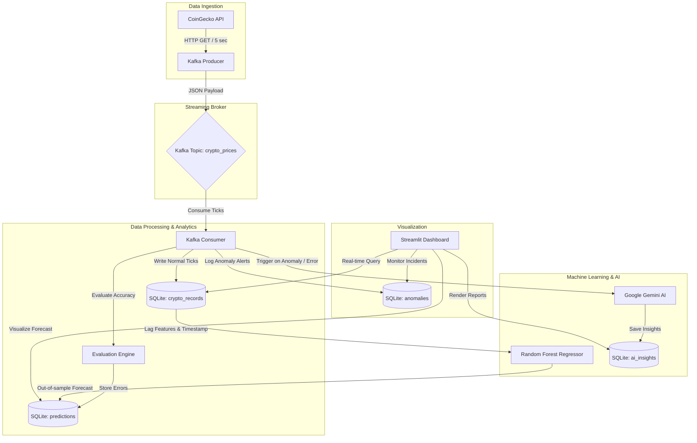

# Real-Time Cryptocurrency Analytics, ML & AI Streaming Pipeline

[](https://github.com/sravani-vallepu07/Real-time-streaming-analytics-using-kafka)

An end-to-end, production-ready real-time streaming analytics pipeline that ingests cryptocurrency data, processes it via **Apache Kafka**, makes predictive forecasts using a **Random Forest ML Model**, triggers intelligent market reports via **Google Gemini GenAI**, stores records in **SQLite**, and presents a gorgeous visual analytics dashboard in **Streamlit**.

This architecture is custom-built to showcase professional **Data Science, Data Engineering, and GenAI** capabilities in interviews.

---

## 🌐 Live Demo
👉 **[Click here to view the live dashboard](https://github.com/sravani-vallepu07/Real-time-streaming-analytics-using-kafka)** *(To run full Kafka streaming locally, follow the setup instructions below)*

---

## 🏗 Architecture Diagram


---

## 📂 Project Structure & File Explanations

Here is how the project components are organized:
```text
├── producer.py          # Fetches live CoinGecko API prices and publishes to Kafka
├── consumer.py          # Subscribes to Kafka, runs ML + GenAI pipelines, stores output
├── database.py          # SQLite database connection, schema creation, and query helpers
├── model.py             # Feature engineering and RandomForestRegressor price forecasting
├── genai_analysis.py    # Integrates Gemini AI API with simulated failover mode
├── app.py               # Streamlit Dashboard with ML metrics, forecasting plots, and insights
├── docker-compose.yml   # Spins up Kafka, Producer, Consumer, and Dashboard services
├── Dockerfile           # Multi-stage Python build recipe for containers
├── requirements.txt     # Python package requirements
└── README.md            # Extensive documentation and setup guide
```

### File and Major Function Explanations:
1. **`database.py`**:
   - `init_db()`: Sets up the tables for raw data, predictions, anomalies, and AI reports.
   - `save_crypto_record()`: Ingests the raw prices.
   - `update_prediction_actual()`: Matches new prices with prior ML predictions to track live error margins.
   - `get_last_prices()`: Queries previous ticks to calculate rapid price shifts.
2. **`model.py`**:
   - `prepare_features()`: Creates supervised learning lag features, standard price change rates, and timestamp properties (hour, minute, dayofweek).
   - `train_and_predict()`: Fits a `RandomForestRegressor` in real-time, validates performance, and outputs the next price prediction.
3. **`genai_analysis.py`**:
   - `generate_ai_analysis()`: Sends market metrics and predictions to Gemini, parsing a structured JSON analysis.
   - `get_simulated_insight()`: An out-of-the-box simulator fallback if no API key is present.
4. **`consumer.py`**:
   - Subscribes to Kafka topic `crypto_prices`. Evaluates prior predictions, runs real-time anomalies check, fires Gemini triggers, retrains the Random Forest model, and schedules the upcoming prediction.
5. **`app.py`**:
   - Multi-tab UI highlighting live metrics, predictions tracking, forecasting lines, Gemini market analysis logs, anomalies tables, and volatility indicators.

---

## 🗃 Database Schema

The pipeline automatically configures four structured SQLite tables in `crypto_data.db`:

### 1. `crypto_records`
| Column | Type | Description |
|---|---|---|
| `id` | INTEGER | Primary Key (Autoincrement) |
| `timestamp` | INTEGER | Unix epoch time (Unique) |
| `bitcoin_price` | REAL | Price of BTC in USD |
| `ethereum_price` | REAL | Price of ETH in USD |
| `solana_price` | REAL | Price of SOL in USD |

### 2. `predictions`
| Column | Type | Description |
|---|---|---|
| `id` | INTEGER | Primary Key (Autoincrement) |
| `timestamp` | INTEGER | Unix epoch time target (Unique) |
| `coin_name` | TEXT | Cryptocoin identifier (e.g. `bitcoin`) |
| `actual_price` | REAL | Realized actual price (filled retroactively) |
| `predicted_price`| REAL | Forecasted price generated by Random Forest |
| `prediction_error`| REAL | Absolute prediction error percentage |

### 3. `anomalies`
| Column | Type | Description |
|---|---|---|
| `id` | INTEGER | Primary Key (Autoincrement) |
| `timestamp` | INTEGER | Incident timestamp |
| `coin_name` | TEXT | Cryptocoin identifier |
| `price` | REAL | Valuation at time of anomaly |
| `reason` | TEXT | Description of breach (e.g., Extreme swing or high model error) |

### 4. `ai_insights`
| Column | Type | Description |
|---|---|---|
| `id` | INTEGER | Primary Key (Autoincrement) |
| `timestamp` | INTEGER | Generation timestamp |
| `coin_name` | TEXT | Cryptocoin identifier |
| `current_price` | REAL | Price at trigger |
| `predicted_price`| REAL | Forecast price at trigger |
| `ai_insight` | TEXT | Gemini Financial analyst feedback |
| `risk_level` | TEXT | Risk badge level (`Low`, `Medium`, `High`, `Critical`) |
| `possible_causes`| TEXT | Bulleted list of estimated causes |
| `short_summary` | TEXT | simplified investor-friendly summaries |

---

## 🚀 Setup & Execution Instructions

Ensure you have **Docker Desktop** running on your local machine.

### 1. Configure Environment Variables
Create a file named `.env` in the root folder of the project:
```bash
GEMINI_API_KEY=your_actual_gemini_api_key_here
```
*(If you do not have an API key yet, you can leave it blank or omit it, and the pipeline will automatically run in a high-fidelity Simulation Mode).*

### 2. Run the Containerized Stack
Open your terminal in the project directory and execute:
```bash
docker-compose up -d --build
```
This builds and launches the following:
* **Kafka Broker** (Runs locally in native KRaft mode)
* **Producer Container** (Fetches price updates from API every 5 seconds)
* **Consumer Container** (Performs ML training, predictions, and GenAI updates)
* **Streamlit Dashboard Container** (Renders interactive UI)

### 3. View the Interactive Dashboard
Navigate in your browser to:
👉 **[http://localhost:8501](http://localhost:8501)**

### 4. Shut Down the Services
```bash
docker-compose down
```

---


---

These tailored paragraphs will significantly upgrade your CV:

### For Data Science / ML Roles:
> **Machine Learning & Streaming Analytics Platform**
> * Developed a containerized real-time predictive analytics system utilizing a **Random Forest Regressor** to predict cryptocurrency price movements over live streaming tick feeds.
> * Formulated dynamic feature engineering workflows by computing real-time lag values, percentage momentum variations, and time-based features on streaming data.
> * Implemented an automated continual training engine to periodically fit models on SQLite history, establishing model convergence tracking with live evaluation metrics (MAE, RMSE, Error %).

### For Data Engineering Roles:
> **Real-Time Data Streaming & Infrastructure Pipeline**
> * Architected an end-to-end decoupled streaming pipeline ingesting cryptocurrency market values from REST APIs using **Apache Kafka** brokers to handle high-frequency data streams.
> * Standardized robust SQLite schemas and created transactional ingestion functions, supporting live retroactive prediction matching to prevent system latency bottlenecks.
> * Containerized the entire infrastructure stack (Kafka Broker, Producer, Consumer, Database volumes, and Streamlit) using **Docker Compose** for seamless single-command environments.

### For GenAI / AI Engineer Roles:
> **Generative AI Market Intelligence & Alert System**
> * Integrated the **Google Gemini AI** SDK within a real-time data streaming pipeline to automate structured, investor-friendly financial intelligence.
> * Designed structured prompt constraints enforcing JSON schemas to parse and persist granular qualitative data (Risk Assessments, Market Drivers, and Summaries).
> * Built an event-driven triggering engine executing Gemini analysis upon detecting price volatility swings (>5%) or high machine learning model forecast deviations.
