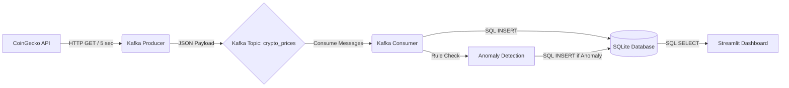

# Real-Time Cryptocurrency Analytics Pipeline

## 📖 Project Overview
This project is a real-world streaming data pipeline that ingests real-time cryptocurrency prices, processes them using Apache Kafka, stores the records in an SQLite database, and visualizes the trends via a live Streamlit dashboard. It also includes simple rule-based anomaly detection.

## 🏗 Architecture Diagram


## 📂 File Explanations
* **`producer.py`**: Connects to the public CoinGecko API every 5 seconds, fetches current prices for Bitcoin, Ethereum, and Solana, and publishes this JSON data to a Kafka topic.
* **`consumer.py`**: Subscribes to the Kafka topic. Upon receiving data, it performs simple anomaly detection (e.g., checking if Bitcoin price exceeds thresholds) and saves the raw data and any anomalies to an SQLite database (`crypto_data.db`).
* **`app.py`**: A Streamlit web dashboard that connects to the SQLite database. It displays real-time price trends using interactive charts, summary metrics, and tables for both normal records and detected anomalies.
* **`requirements.txt`**: Contains the Python dependencies required to run the project.

## 🚀 How to Run the Project (with Docker)

This project is fully containerized using Docker Compose. All you need is Docker installed on your machine!

1. **Start the Entire Pipeline**:
   Open a terminal in the project directory and run:
   ```bash
   docker-compose up -d --build
   ```
   This single command will spin up:
   * **Kafka Broker**
   * **Producer** (Fetching API data)
   * **Consumer** (Saving data to SQLite)
   * **Streamlit Dashboard**
   
2. **View the Dashboard**:
   Open your browser and navigate to:
   [http://localhost:8501](http://localhost:8501)

3. **To Stop the Pipeline**:
   ```bash
   docker-compose down
   ```

---

## 📸 Dashboard Screenshots

Here is a look at the real-time analytics dashboard in action:


*(Save your first screenshot showing the metrics here as `dashboard_metrics.png`)*


*(Save your charts screenshot here as `dashboard_charts.png`)*

---

## 💼 Resume Description
**Data Engineering Project: Real-Time Streaming Analytics Pipeline**
* **Technologies:** Python, Apache Kafka, SQLite, Streamlit, REST APIs.
* Designed and built an end-to-end real-time data streaming pipeline to ingest and process live cryptocurrency data from the CoinGecko REST API.
* Implemented a Kafka Producer to reliably publish JSON data and a Kafka Consumer to ingest messages, apply simple rule-based anomaly detection, and persist data to an SQLite database.
* Developed an interactive analytics dashboard using Streamlit and Plotly to visualize real-time price trends, metrics, and flagged anomalies, ensuring high visibility of streaming data.

---

## 🎤 Interview Questions & Answers

**Q1: Why did you choose Apache Kafka for this project instead of just writing directly to the database?**
* **Answer:** Kafka decouples the data producer from the data consumer. If the database goes down or the consumer crashes, Kafka retains the messages in its topic. Once the consumer recovers, it can pick up right where it left off, preventing data loss. It also makes the architecture scalable; if I wanted to add another consumer (e.g., for sending email alerts), I could do so without changing the producer.

**Q2: How does your anomaly detection work, and how would you improve it in a production environment?**
* **Answer:** Currently, it uses static, rule-based thresholds (e.g., if Bitcoin price drops below $30,000). In a real-world scenario, I would implement dynamic anomaly detection such as calculating moving averages or utilizing machine learning models (like Isolation Forests) to detect statistical outliers based on historical trends.

**Q3: Explain the role of the Kafka Consumer Group in your project.**
* **Answer:** A consumer group is a collection of consumers that cooperate to process data from a Kafka topic. In my `consumer.py`, the `group_id` ensures that if I run multiple instances of the consumer, Kafka will distribute the partitions among them, allowing for parallel processing and load balancing.

**Q4: How do you handle API rate limits in your producer?**
* **Answer:** I implemented a `time.sleep(5)` delay in the producer's main loop. This ensures we only make 12 requests per minute, which safely keeps us below the CoinGecko free tier limit (usually 10-30 requests per minute), preventing IP bans or HTTP 429 Too Many Requests errors.
