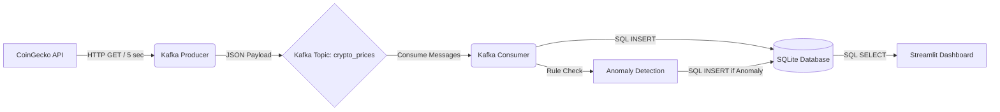

# Real-Time Cryptocurrency Analytics Pipeline

## 📖 Project Overview
This project is a real-world streaming data pipeline that ingests real-time cryptocurrency prices, processes them using Apache Kafka, stores the records in an SQLite database, and visualizes the trends via a live Streamlit dashboard. It also includes simple rule-based anomaly detection.

## 🏗 Architecture Diagram


## 📂 File Explanations
* **`producer.py`**: Connects to the public CoinGecko API every 5 seconds, fetches current prices for Bitcoin, Ethereum, and Solana, and publishes this JSON data to a Kafka topic.
* **`consumer.py`**: Subscribes to the Kafka topic. Upon receiving data, it performs simple anomaly detection (e.g., checking if Bitcoin price exceeds thresholds) and saves the raw data and any anomalies to an SQLite database (`crypto_data.db`).
* **`app.py`**: A Streamlit web dashboard that connects to the SQLite database. It displays real-time price trends using interactive charts, summary metrics, and tables for both normal records and detected anomalies.
* **`requirements.txt`**: Contains the Python dependencies required to run the project.

## 🚀 How to Run the Project (with Docker)

This project is fully containerized using Docker Compose. All you need is Docker installed on your machine!

1. **Start the Entire Pipeline**:
   Open a terminal in the project directory and run:
   ```bash
   docker-compose up -d --build
   ```
   This single command will spin up:
   * **Kafka Broker**
   * **Producer** (Fetching API data)
   * **Consumer** (Saving data to SQLite)
   * **Streamlit Dashboard**
   
2. **View the Dashboard**:
   Open your browser and navigate to:
   [http://localhost:8501](http://localhost:8501)

3. **To Stop the Pipeline**:
   ```bash
   docker-compose down
   ```

---

## 💼 Resume Description
**Data Engineering Project: Real-Time Streaming Analytics Pipeline**
* **Technologies:** Python, Apache Kafka, SQLite, Streamlit, Docker, REST APIs.
* Designed and built an end-to-end real-time data streaming pipeline to ingest and process live cryptocurrency data from the CoinGecko REST API.
* Implemented a Kafka Producer to reliably publish JSON data and a Kafka Consumer to ingest messages, apply simple rule-based anomaly detection, and persist data to an SQLite database.
* Developed an interactive analytics dashboard using Streamlit and Plotly to visualize real-time price trends, metrics, and flagged anomalies.
* Containerized the entire pipeline using Docker Compose for one-command deployment.
